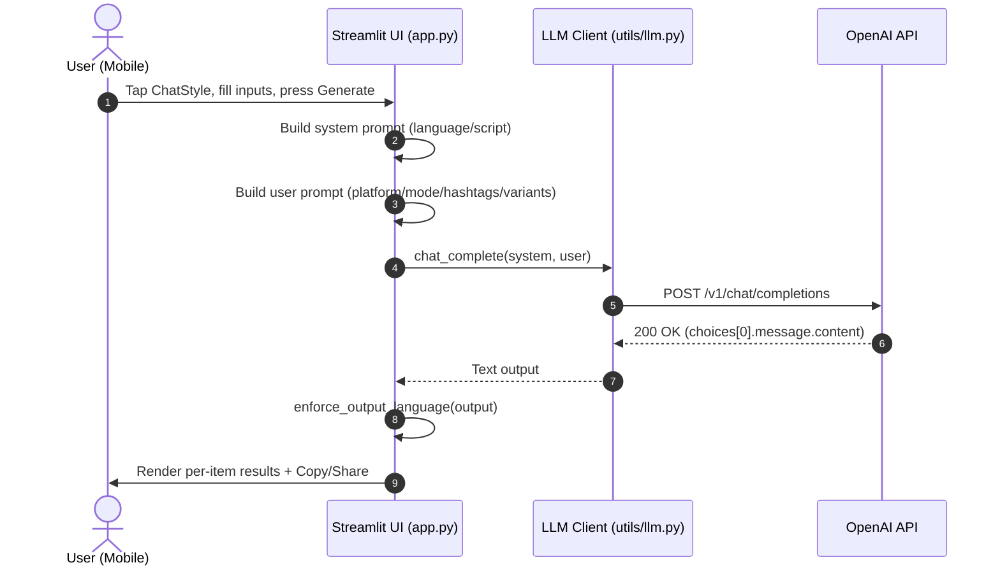
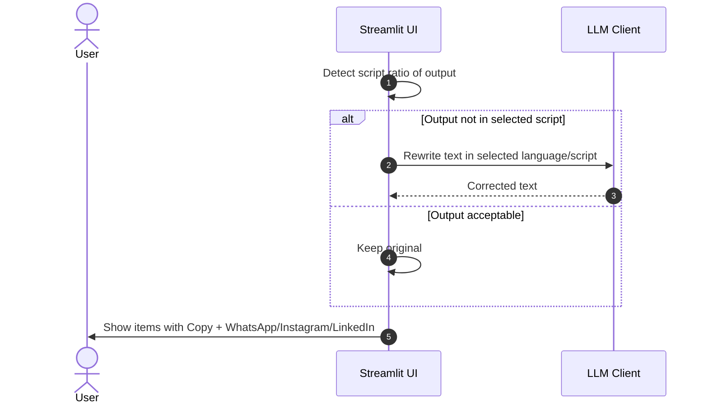

# SmartBuddy.AI — Architecture

This document describes the overall architecture, data flow, and key design decisions for SmartBuddy.AI. It also includes sequence diagrams covering typical user interactions and LLM calls.

## Overview

- Platform: Streamlit (Python)
- Purpose: Mobile‑friendly AI assistant with four tools in one link
  - ChatStyle — captions & posts
  - TalkSmart — relationship & conversation helper
  - QuickTranslate — EN/MR/KN/HI translator
  - DailyPal — day planner (optional)
- Model: OpenAI Chat Completions (configurable via `OPENAI_MODEL`, default `gpt-4o-mini`)
- Privacy: No persistence; session‑scoped only
- Share: WhatsApp, Instagram (opens app), LinkedIn (prefill), plus Copy per output block

## High‑Level Components

- UI Layer (Streamlit): `app.py`
  - Home tiles, sticky bottom navigation
  - Tabs/sections for tools
  - Copy/share buttons, per‑item rendering
  - Dark, mobile‑first styling and language selector
- LLM Client Wrapper: `utils/llm.py`
  - `chat_complete(system, user, ...)` with retries (tenacity)
  - Environment‑based configuration
- Config & Theme
  - `.streamlit/config.toml` (theme)
  - `.env` (secrets, local only), `runtime.txt`, `requirements*.txt`

## Directory Layout

```
SmartBuddy.AI/
├─ app.py                     # Streamlit app (UI + flows)
├─ utils/
│  └─ llm.py                  # OpenAI client wrapper + retries
├─ .streamlit/
│  └─ config.toml             # Theme colors
├─ requirements.txt           # Pinned deps
├─ requirements.lock.txt      # Locked deps (reproducible)
├─ runtime.txt                # Python version pin
├─ .env.example               # Example environment
├─ .env                       # Local secrets (gitignored)
├─ .gitignore
├─ install.ps1                # Windows install (venv + deps)
├─ run.ps1                    # Run with local venv
├─ README.md                  # Getting started + deploy
└─ ARCHITECTURE.md            # This document
```

## Data Flow

- User fills inputs in Streamlit UI and triggers a tool action (Generate / Suggest / Translate / Plan)
- UI constructs:
  - System prompt with strict language + script enforcement
  - User prompt with tool‑specific instructions
- `utils/llm.py` sends a chat completion request to OpenAI and returns text
- UI renders output, validates/enforces language script, and shows per‑block Copy + Share

## Sequence Diagram — ChatStyle (Happy Path)



## Sequence Diagram — Language Enforcement & Share



## Key Helpers (app.py)

- `build_system_prompt(language_label)` — Adds strict language/script rules
- `ensure_output_language(text, language_label)` — Post‑process output; auto‑rewrite if drifted
- `render_outputs_with_copy(out_text, key_prefix)` — Splits into blocks; renders per‑item Copy + Share
- `share_buttons(text)` — Renders WhatsApp / Instagram / LinkedIn links per item

## Error Handling

- Tenacity retries (exponential backoff) for transient LLM errors
- UI shows `st.exception(e)` with root cause; unwraps `RetryError` to inner exception for clarity
- Version pinning avoids httpx/openai mismatches

## Configuration

- Env vars:
  - `OPENAI_API_KEY` — required
  - `OPENAI_MODEL` — optional (default `gpt-4o-mini`)
- Runtime: Python 3.10.13 (pinned)
- Deps: pinned & lock file for reproducibility (Streamlit, OpenAI, httpx 0.27.x, etc.)

## Deployment Notes

- Streamlit Community Cloud
  - Entry point: `app.py`
  - Secrets: set `OPENAI_API_KEY`
  - `runtime.txt` pins Python version
- Hugging Face Spaces (Streamlit)
- Vercel (via Streamlit runtime) — ensure Python + env configured

## Performance & UX

- Mobile‑first layout (single column, max‑width ~720px)
- Large gradient primary buttons (≥ 48px)
- Sticky bottom navigation for one‑hand use
- Minimal synchronous calls; LLM operations only on user actions

## Security & Privacy

- No server‑side persistence; session‑only UI
- Keys loaded from environment or `.env` (local only; gitignored)
- Avoids logging user prompts/outputs in files

## Internationalization (i18n)

- Language selector (EN/MR/KN/HI)
- System prompt enforces language + script (Devanagari for MR/HI, Kannada for KN)
- Post‑enforcement rewrite if output drifts to wrong language/script

## Future Enhancements

- Optional: “Keep hashtags in English” toggle for discoverability
- Streaming tokens & partial render for responsiveness
- Offline fallback (local heuristics for very small tasks)
- Analytics (privacy‑respecting) for feature usage insights
- Templates/history (client‑side) if needed without storing data on server

```
This doc intentionally focuses on architectural clarity, flows, and deployment posture to streamline onboarding and handoffs.
```

## Component Diagram

```mermaid
graph LR
  subgraph Client[Mobile Browser]
    U[User]
  end

  subgraph App[Streamlit App (app.py)]
    UI[UI Components<br/>Home Tiles / Sections / Bottom Nav]
    LANG[Language Selector + Enforcement]
    RENDER[Per‑Item Render + Copy/Share]
    STYLE[Dark Theme / CSS / Config]
  end

  subgraph Utils[LLM Wrapper (utils/llm.py)]
    LLM[chat_complete()<br/>Tenacity Retries]
  end

  subgraph Config[Configuration]
    ENV[(.env / OPENAI_API_KEY)]
    RUNTIME[runtime.txt]
    REQS[requirements(.lock).txt]
    THEME[.streamlit/config.toml]
  end

  subgraph Ext[External Services]
    OA[OpenAI API]
    WA[WhatsApp]
    IG[Instagram]
    LI[LinkedIn]
  end

  U --> UI
  UI --> LANG
  UI --> RENDER
  UI --> STYLE
  UI --> LLM
  LLM --> OA
  RENDER --> WA
  RENDER --> IG
  RENDER --> LI
  STYLE --> THEME
  App --> ENV
  App --> REQS
  App --> RUNTIME
```
